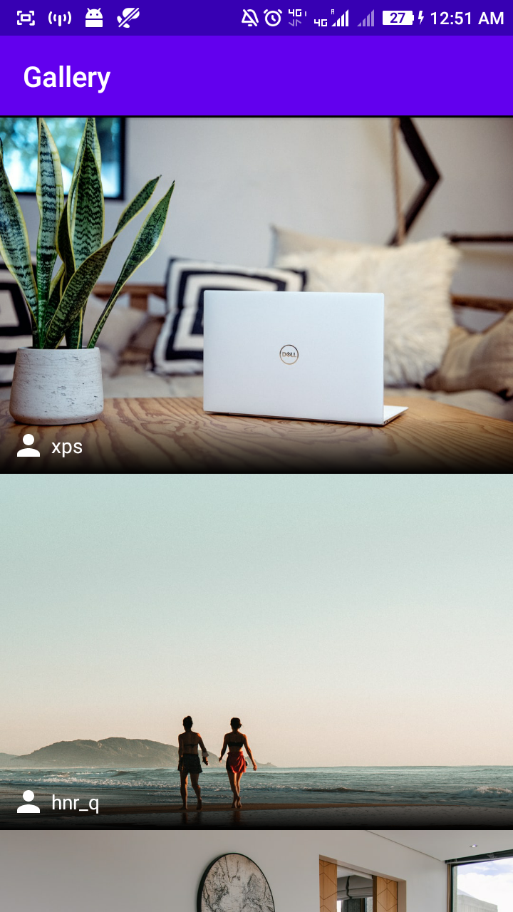

  
# Imageo
Imageo is a sample PhotoViewerApp 😃 Android application 📱 built to demonstrate use of Modern Android development tools.

About
-------------------------------------------------------------------------
It simply loads Photos data from API 

Each photo can be viewed seperately by clicking on it

## Built With 🛠
- [Kotlin](https://kotlinlang.org/) - First class and official programming language for Android development.
- [Coroutines](https://kotlinlang.org/docs/reference/coroutines-overview.html) - For asynchronous and more
- [Android Architecture Components](https://developer.android.com/topic/libraries/architecture) - Collection of libraries that help you design robust, testable, and maintainable apps.
  - [LiveData](https://developer.android.com/topic/libraries/architecture/livedata) - Data objects that notify views when the underlying database changes.
  - [ViewModel](https://developer.android.com/topic/libraries/architecture/viewmodel) - Stores UI-related data that isn't destroyed on UI changes. 
  - [ViewBinding](https://developer.android.com/topic/libraries/view-binding) - Generates a binding class for each XML layout file present in that module and allows you to more easily write code that interacts with views.
- [Dependency Injection](https://developer.android.com/training/dependency-injection) - 
  - [Hilt-Dagger](https://dagger.dev/hilt/) - Standard library to incorporate Dagger dependency injection into an Android application.
  - [Hilt-ViewModel](https://developer.android.com/training/dependency-injection/hilt-jetpack) - DI for injecting `ViewModel`.
- [Retrofit](https://square.github.io/retrofit/) - A type-safe HTTP client for Android and Java.

## Architecture
This app uses [***MVVM (Model View View-Model)***](https://developer.android.com/jetpack/docs/guide#recommended-app-arch) architecture.

